VIM - ColdFusion Syntax Highlighter
====================================
Developed by Ernst M. van der Linden - [ernst.vanderlinden@ernestoz.com](mailto:ernst.vanderlinden@ernestoz.com)

Copyright and License
-------
#### ColdFusion
Coldfusion is either a registered trademark or trademark of [Adobe Systems Incorporated](http://www.adobe.com).

#### Vim
[Vim](http://www.vim.org) is charityware. Its license is GPL-compatible, so it's distributed freely, but we ask that if you find it useful you make a donation to help children in Uganda through the [ICCF](http://iccf-holland.org). The full license text can be found in the [documentation](http://vimdoc.sourceforge.net/htmldoc/uganda.html#license).

#### Syntax Highlighter
Copyright (c) 2016 Ernst M. van der Linden - ernst.vanderlinden@ernestoz.com

This program is free software: you can redistribute it and/or modify
it under the terms of the GNU General Public License as published by
the Free Software Foundation, either version 3 of the License, or
(at your option) any later version.

This program is distributed in the hope that it will be useful,
but WITHOUT ANY WARRANTY; without even the implied warranty of
MERCHANTABILITY or FITNESS FOR A PARTICULAR PURPOSE.  See the
GNU General Public License for more details.

You should have received a copy of the GNU General Public License
along with this program.  If not, see <http://www.gnu.org/licenses/>.


Background
----------
Since 1996 I'm working as a full stack web enterprise application developer.
Eclipse has been my main programming editor for years. It's the IDE where I
feel "at home" when programming in Java, ColdFusion, C or Scala. It integrates well
with Ant, Maven, Gradle, Spring, Jenkins, Mylyn, task and git repos. The [Vrapper
Eclipse Plugin](http://vrapper.sourceforge.net) keeps my brain in hjkl mode.

Xcode is my environment for iOS development only. Now and then I use Emacs -nw
with Evil mode, for example to view/edit really large syntax colored sql files.
Intellij with [IdeaVim](https://github.com/JetBrains/ideavim) works best for me when writing code in Node.js or Python.

During the day, I spend a lot of my time in the BASH shell (inside [TMUX](https://tmux.github.io) within [iTerm](https://www.iterm2.com)).
It somehow feels "closer to the metal" to me to compile, build, commit code or
execute Ant/Gradle tasks from the command line instead of from within my IDE.

Vim is my prefered terminal editor for editing (remote) shell scripts, text and
conf files. Though I use Vim for local editing source code files as well.

>Sublime and Atom (including Vim-mode) are both great text editors too.
>For whatever reason, they just don't fit in my personal workflow.

Current Syntax Highlighting
---------------------------
[Toby Woodwark's](toby.woodwark+vim@gmail.com) cf.vim syntax highlighter has
been included in Vim's core install for a couple of years now. He really did a
great job developing it and deserves all credits for that. Due to several
reasons, Toby unfortunately couldn't keep the code up to date. Therefore
advanced syntax highlighting rules for "new" ColdFusion features, like cfscript
or component syntax, have been poorly or even not been implemented.

Improved Syntax Highlighting
----------------------------
When looking at Toby's code, for example the cfscript implementation, I
realized with all respect, starting from scratch was the way to go.

### Deliverable
Create an efficient, complete and future prove Vim ColdFusion syntax highlighter
which is maintainable, supports folding, themes and allows custom coloring.
Create one which I personally will use, as it's always good to eat your own
dog food while sharing with others.

### Resources
To get the project started, I looked at the following resources:

- Official [CFML TextMate Bundle](https://github.com/textmate/coldfusion.tmbundle)
- Great [TextMate port to Atom](https://atom.io/packages/language-cfml) by [atuttle](https://atom.io/users/atuttle)
- Apple's opensource [xml.vim](http://opensource.apple.com//source/vim/vim-44/runtime/syntax/xml.vim)
- Man pages of Vim by [Bram Molenaar](https://en.wikipedia.org/wiki/Bram_Moolenaar)

Vim's man pages are my best friends as is [Dash](https://kapeli.com/dash).

### Function
One of my first decision was **not** to implement a huge `OR` regex for all available
ColdFusion core functions and their attributes. Some quick tests proved this
would have huge impact on syntax highlighting performance. 

In addition, it would be tedious to keep these regex patterns up to
date as new functions will be added on each ColdFusion release. Therefore core and
custom functions are treated the same and follow the exact same coloring rules.

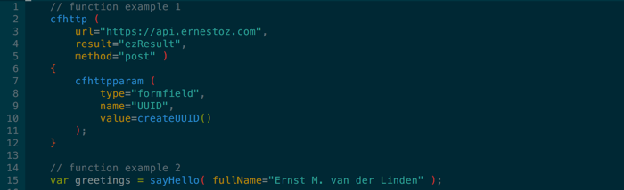

#### Irregular Core Function
To my opnion, the ColdFusion language has some inconsistent function syntax
implementations, for example:
```coldfusion
transaction action="rollback";
abort "Operation Aborted";
```
instead of
```coldfusion
transaction( action="rollback" );
abort( showerror="Operation Aborted" );
```
The following **odd functions** are grouped together in one syntax highlight group:

`abort`
`exit`
`import`
`include`
`lock`
`pageencoding`
`param`
`savecontent`
`thread`
`transaction`

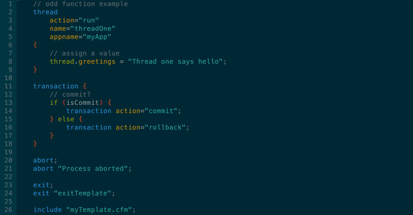

### Tag
As with functions, regarding performance, checking for **all** available
ColdFusion tags would be a bad design decision. However some tags are good
candidates for code folding, so regex patterns for the following foldable tags
have been implemented:

- cfcomponent
- cffunction
- cfif
- cfloop
- cfoutput
- cfquery
- cfsavecontent
- cfscript
- cfswitch
- cftransaction
- custom tag

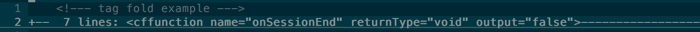

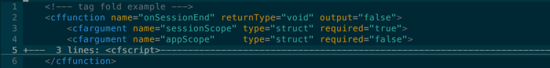

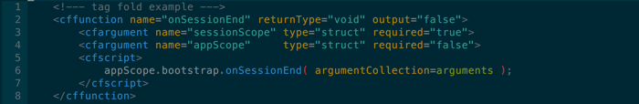

#### Vim Folding
In Vim there are different methods to fold buffer content. If you prefer
automatic syntax folding, please enable it with one of the following commands:

- **Current Session**
```viml
:set foldmethod=syntax
```
- **Current Buffer**
```viml
:setlocal foldmethod=syntax
```
- **Globally** add to .vimrc
```viml
set foldmethod=syntax
```

To expand all folded content press `zR` in normal mode and `zM` to collapse all.
Use `za` to toggle folding for one level, which I prefer above pressing `zo` to
open and `zc` to close a fold.

#### Tag Bracket
Brackets of ColdFusion (custom) tags have their own coloring rules.

`<` tagName `>` `</` tagName `>`

#### Tag Name
The tag names of the start and end tag use the same color group.

< `tagName` > </ `tagName` >

#### Tag Attribute Name and Value
See *attribute name and value pair*

### Core Keyword
ColdFusion has some special words which are colored by the CoreKeyword group.

`new`
`required`

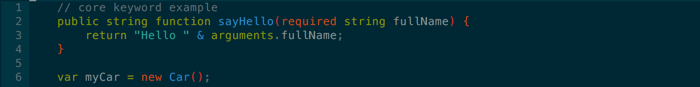

>You can add your own custom keywords to the CustomKeyword group.

### Core Scope
All core scopes of ColdFusion are highlighted by CoreScope.

`application`
`arguments`
`attributes`
`caller`
`cfcatch`
`cffile`
`cfhttp`
`cgi`
`client`
`cookie`
`form`
`local`
`request`
`server`
`session`
`super`
`thisTag`
`this`
`thread`
`url`
`variables`

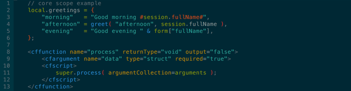

>You can add your own custom scopes to the CustomScope group.

### Hash Surround
Variables, functions and expressions surrounded by hashes.

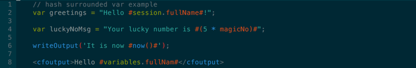

### Punctuation
These punctuation elements can be colored independently.

`.`
`,`
`;`
 `'`
 `"`
 `[ ]`
 `( )`
 `{ }`

**Nested Parentheses**

Three levels of parentheses are highlighted in different colors.
If you prefer to go "extreme" with nested colored braces or parenthesis,
you might consider to install the [rainbow]( https://github.com/luochen1990/rainbow) plugin.

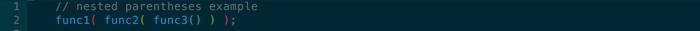

**Quoted Value**

Single and double quoted strings each have their own syntax highlight group. They can
be nested and can span multiple lines.

`"My String"`
`'My String'`

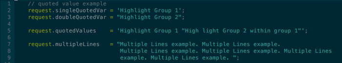

### Operator
Operators have been grouped and can be colored by type.

- **Arithmetic Operator**

    `+7`
    `-7`
    `++i`
    `--i`
    `i++`
    `i--`
    `+`
    `-`
    `*`
    `/`
    `%`
    `+=`
    `-=`
    `*=`
    `/=`
    `%=`
    `^` `
    mod`

- **Boolean Operator**

    `not`
    `and`
    `or`
    `xor`
    `eqv`
    `imp`
    `!`
    `&&`
    `||`

- **Decision Operator**

    `is`
    `equal`
    `eq`
    `is not`
    `not equal`
    `neq`
    `contains`
    `does not contain`
    `greater than`
    `gt`
    `less than`
    `lt`
    `greater than or equal to`
    `gte`
    `ge`
    `less than or equal to`
    `lte`
    `le`
    `==`
    `!=`
    `>`
    `<`
    `>=`
    `<=`

- **String Operator**

    `&`
    `&=`

- **Ternary Operator**

    `myBoolean ? true : false`

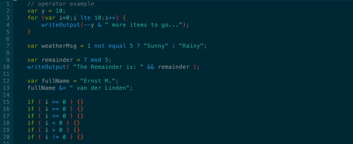

### Comment

- **Block Comment** 

    `/* block comment */`

- **Line Comment** 

    `// line comment`

- **Tag Comment** 

    `<!--- tag comment --->`

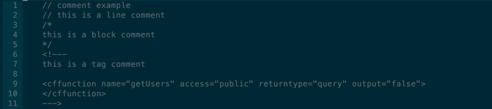

### Flow Statement
Flow statements have been grouped and can be highlighted by type.

- **Branch Flow**

    `break`
    `continue`
    `return`

- **Decision Flow**

    `case`
    `defaultcase`
    `else`
    `if`
    `switch`

- **Loop Flow**

    `do`
    `for`
    `in`
    `while`

- **Try Flow**

    `catch`
    `finally`
    `rethrow`
    `throw`
    `try`


### Attribute Name and Value Pair
The name, value and equal sign of an attribute assignment can be colored separately.

&lt;tagName `name` `=` `value` &gt; &lt;/tagName&gt;


### Meta Data
Meta data name and value pairs are colored independently within comment blocks.

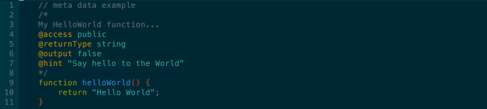

### Component Definition
See screenshot, a component definition with meta data, an odd function
"pageencoding", a property and a simple method.

**Component Keyword**

`component`

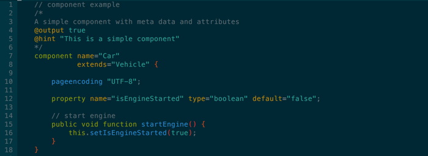

### Property
Can be defined in one or multiple lines.

**Property Keyword**

`property`

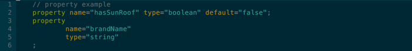

### Storage
- **Storage Keyword**

    `var`

- **Storage Type**

    Variable type definition contained within parentheses.

    `any`
    `array`
    `binary`
    `boolean`
    `date`
    `numeric`
    `query`
    `string`
    `struct`
    `uuid`
    `void`
    `xml`

### Function Definition
Each syntax element of a function definition has its own highlight group.

- **Function Modifier**

    `public`
    `private`
    `package`

- **Function Return Type**

    Same as *Storage Type*, but can be highlighted with a different color.

- **Function Keyword**

    `function`

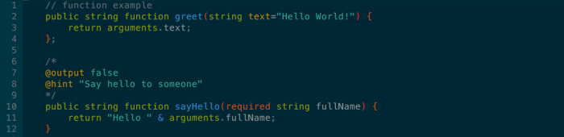

### Interface Definition
An interface definition has its own highlight group, though contains other groups.

**Interface Keyword**

`interface`

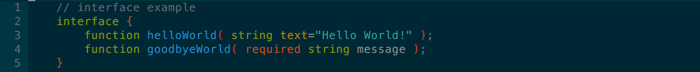

### Sql Statement
The sql syntax coloring is handled by Vim's core sql.vim combined with custom
CF highlighting for numbers, dots, quotes, quoted values, parentheses, hash
surrounded vars and ColdFusion functions.

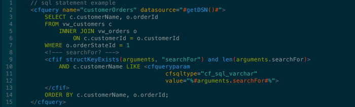
### Vim sql_type_default
Vim's default sql syntax is sqloracle.vim, but you can easily override the
default sql syntax type globally.

**Add the following to ~/.vimrc** 
```viml
let g:sql_type_default = 'mysql'
```

SGML
----
The standard HTML syntax highlighter (html.vim) contains a lot of regex keywords. On top of the ColdFusion Syntax Highlighter this would affect performance. Therefore I added additional regex rules to color SGML tags and their attributes, to avoid loading Vim's HTML highlighter.

In the example below the html highlighting is handled by the ColdFusion Syntax Highlighter.
Two custom scopes are highlighted, to be specific **prc** and **event**.

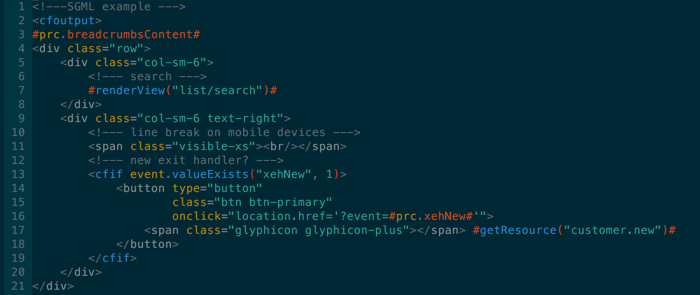

Highlight Group
---------------
An overview of all available syntax highlight groups.

```viml
hi link eozNumber Number
hi link eozBoolean Boolean
hi link eozEqualSign Keyword
" HASH SURROUND
hi link eozHashSurround PreProc
" OPERATOR
hi link eozArithmeticOperator Function
hi link eozBooleanOperator Function
hi link eozDecisionOperator Function
hi link eozStringOperator Function
hi link eozTernaryOperator Function
" PARENTHESIS
hi link eozParenthesis1 Statement
hi link eozParenthesis2 String
hi link eozParenthesis3 Delimiter
" BRACE
hi link eozBrace PreProc
" PUNCTUATION - BRACKET
hi link eozBracket Statement
" PUNCTUATION - CHAR
hi link eozComma Comment
hi link eozDot Comment
hi link eozSemiColon Comment
" PUNCTUATION - QUOTE
hi link eozDoubleQuote String
hi link eozDoubleQuotedValue String
hi link eozSingleQuote String
hi link eozSingleQuotedValue String
" TAG START AND END
hi link eozTagName Function
hi link eozTagBracket Comment
" ATTRIBUTE NAME AND VALUE
hi link eozAttrName Type
hi link eozAttrValue Special
" COMMENT
hi link eozCommentBlock Comment
hi link eozCommentLine Comment
hi link eozTagComment Comment
" FLOW STATEMENT
hi link eozDecisionFlowKeyword Conditional
hi link eozLoopFlowKeyword Repeat
hi link eozTryFlowKeyword Exception
hi link eozBranchFlowKeyword Keyword
" STORAGE KEYWORD
hi link eozStorageKeyword Keyword
" STORAGE TYPE
hi link eozStorageType Keyword
" CORE KEYWORD
hi link eozCoreKeyword PreProc
" CORE SCOPE
hi link eozCoreScope Keyword
" TAG IN SCRIPT
hi link eozTagNameInScript Function
" METADATA
" meta data value = eozMetaData
hi link eozMetaData String
hi link eozMetaDataName Type
" COMPONENT DEFINITION
hi link eozComponentKeyword Keyword
" INTERFACE DEFINITION
hi link eozInterfaceKeyword Keyword
" PROPERTY
hi link eozPropertyKeyword Keyword
" FUNCTION DEFINITION
hi link eozFunctionKeyword Keyword
hi link eozFunctionModifier Keyword
hi link eozFunctionReturnType Keyword
hi link eozFunctionName Function
" ODD FUNCTION
hi link eozOddFunctionKeyword Function
" CUSTOM
hi link eozCustomKeyword Keyword
hi link eozCustomScope Structure
```
### Source Code Structure
The structure and folded content of **syntax/eoz.vim**.

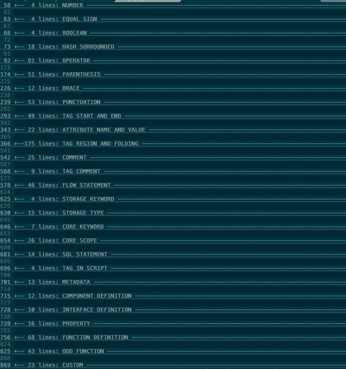

Install
-------
You can install the syntax highlighter plugin manually or by using your favorite
package manager, in my case Pathogen. 

#### Tim Pope's [Pathogen](https://github.com/tpope/vim-pathogen)

``` bash
cd ~/.vim/bundle
git clone https://github.com/ernstvanderlinden/vim-coldfusion.git
```

#### ~/.vimrc
It is prefered in Vim to use the file extension as the file name for automatically loading syntax highlighters. Though to avoid naming conflicts with existing syntax highlighters, I prefixed all groups with 'eoz' (ernestoz).

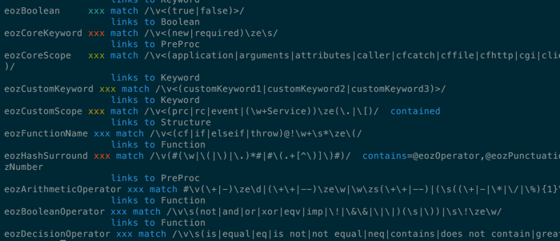

**Add the following to your ~/.vimrc**
``` viml
autocmd FileType eoz
    \ setlocal
      \ expandtab
      \ foldmethod=syntax
      \ shiftwidth=4
      \ smarttab
      \ softtabstop=0
      \ tabstop=4

autocmd Bufread,BufNewFile *.cfm set filetype=eoz
autocmd Bufread,BufNewFile *.cfc set filetype=eoz
```

### Color Scheme

The syntax highlight colors depend on Vim's active color scheme. There are many
schemes available, choose one whichever you like. 

#### Custom Scheme
If you prefer custom colors, please have a look at [Vim color names](http://vim.wikia.com/wiki/Xterm256_color_names_for_console_Vim).

#### Solarized

As you propably noticed, looking at my screenshots, I personally use Ethan
Schoonover's great color scheme [Solarized
Dark](http://ethanschoonover.com/solarized).

`git clone git://github.com/altercation/vim-colors-solarized.git ~/.vim/bundle`

Feedback
--------
It has been an intensive journey to develop the first public release of this
Vim ColdFusion Syntax Highlighter.  Sharpening my regex skills and forcing
myself to implement everything I could possibly think of.

Though, [Nobody's Perfect](https://www.youtube.com/watch?v=FbniqEvs38A) and so
am I. Therefore, if you have suggestions, remarks to improve the syntax
highlighter, please let me know through
[ernst.vanderlinden@ernestoz.com](mailto:ernst.vanderlinden@ernestoz.com)
