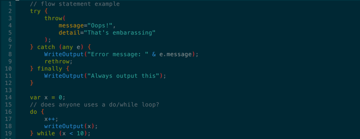
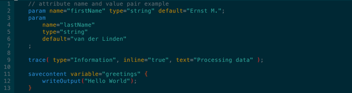

> This syntax highlighter is included in the official [Vim](http://www.vim.org) repository since 2017.
> 
> Please see https://github.com/vim/vim/blob/master/runtime/syntax/cf.vim


VIM - CFML Syntax Highlighter
====================================
Developed by Ernst M. van der Linden - [ernst.vanderlinden@ernestoz.com](mailto:ernst.vanderlinden@ernestoz.com)

Copyright and License
-------
#### ColdFusion
ColdFusion is either a registered trademark or trademark of [Adobe Systems Incorporated](http://www.adobe.com).

#### Vim
[Vim](http://www.vim.org) is charityware. Its license is GPL-compatible, so it's distributed freely, but we ask that if you find it useful you make a donation to help children in Uganda through the [ICCF](http://iccf-holland.org). The full license text can be found in the [documentation](http://vimdoc.sourceforge.net/htmldoc/uganda.html#license).

#### CFML Syntax Highlighter
The MIT License (MIT)

Copyright (c) 2016 Ernst M. van der Linden - ernst.vanderlinden@ernestoz.com

Permission is hereby granted, free of charge, to any person obtaining a copy of
this software and associated documentation files (the "Software"), to deal in
the Software without restriction, including without limitation the rights to
use, copy, modify, merge, publish, distribute, sublicense, and/or sell copies
of the Software, and to permit persons to whom the Software is furnished to do
so, subject to the following conditions:

The above copyright notice and this permission notice shall be included in all
copies or substantial portions of the Software.

THE SOFTWARE IS PROVIDED "AS IS", WITHOUT WARRANTY OF ANY KIND, EXPRESS OR
IMPLIED, INCLUDING BUT NOT LIMITED TO THE WARRANTIES OF MERCHANTABILITY,
FITNESS FOR A PARTICULAR PURPOSE AND NONINFRINGEMENT. IN NO EVENT SHALL THE
AUTHORS OR COPYRIGHT HOLDERS BE LIABLE FOR ANY CLAIM, DAMAGES OR OTHER
LIABILITY, WHETHER IN AN ACTION OF CONTRACT, TORT OR OTHERWISE, ARISING FROM,
OUT OF OR IN CONNECTION WITH THE SOFTWARE OR THE USE OR OTHER DEALINGS IN THE
SOFTWARE.

Current Syntax Highlighting
---------------------------
[Toby Woodwark's](toby.woodwark+vim@gmail.com) cf.vim syntax highlighter has
been included in Vim's core install for a couple of years now. He really did a
great job developing it and deserves all credits for that. Due to several
reasons, Toby unfortunately couldn't keep the code up to date. Therefore
advanced syntax highlighting rules for "new" ColdFusion features, like cfscript
or component syntax, have been poorly or even not been implemented.

Improved Syntax Highlighting
----------------------------
When looking at Toby's code, for example the cfscript implementation, I
realized with all respect, starting from scratch was the way to go.

### Deliverable
Create an efficient, complete and future prove Vim ColdFusion syntax highlighter
which is maintainable, supports folding, themes and allows custom coloring.
Create one which I personally will use, as it's always good to eat your own
dog food while sharing with others.

### Resources
To get the project started, I looked at the following resources:

- Official [CFML TextMate Bundle](https://github.com/textmate/coldfusion.tmbundle)
- Great [TextMate port to Atom](https://atom.io/packages/language-cfml) by [atuttle](https://atom.io/users/atuttle)
- Apple's opensource [xml.vim](http://opensource.apple.com//source/vim/vim-44/runtime/syntax/xml.vim)
- Man pages of Vim by [Bram Molenaar](https://en.wikipedia.org/wiki/Bram_Moolenaar)

Vim's man pages are my best friends as is [Dash](https://kapeli.com/dash).

### Function
One of my first decisions was **not** to implement a huge `OR` regex for all available
ColdFusion core functions and their attributes. Some quick tests proved this
would have huge impact on syntax highlighting performance.

In addition, it would be tedious to keep these regex patterns up to
date as new functions will be added on each ColdFusion release. Therefore core and
custom functions are treated the same and follow the exact same coloring rules.


#### Irregular Core Function
In my opinion, the ColdFusion language has some inconsistent function syntax
implementations, for example:
```coldfusion
transaction action="rollback";
abort "Operation Aborted";
```
instead of
```coldfusion
transaction( action="rollback" );
abort( showerror="Operation Aborted" );
```
The following **odd functions** are grouped together in one syntax highlight group:

`abort`
`exit`
`import`
`include`
`lock`
`pageencoding`
`param`
`savecontent`
`thread`
`transaction`


### Tag
As with functions, regarding performance, checking for **all** available
ColdFusion tags would be a bad design decision. However some tags are good
candidates for code folding, so regex patterns for the following foldable tags
have been implemented:

- cfcomponent
- cffunction
- cfif
- cfloop
- cfoutput
- cfquery
- cfsavecontent
- cfscript
- cfswitch
- cftransaction
- custom tag


#### Vim Folding
In Vim there are different methods to fold buffer content. If you prefer
automatic syntax folding, please enable it with one of the following commands:

- **Current Session**
```viml
:set foldmethod=syntax
```
- **Current Buffer**
```viml
:setlocal foldmethod=syntax
```
- **Globally** add to ~/.vimrc
```viml
set foldmethod=syntax
```

To expand all folded content press `zR` in normal mode and `zM` to collapse all.
Use `za` to toggle folding for one level, which I prefer above pressing `zo` to
open and `zc` to close a fold.

#### Tag Bracket
Brackets of ColdFusion (custom) tags have their own coloring rules.

`<` tagName `>` `</` tagName `>`

#### Tag Name
The tag names of the start and end tag use the same color group.

< `tagName` > </ `tagName` >

#### Tag Attribute Name and Value
See *attribute name and value pair*

### Core Keyword
ColdFusion has some special words which are colored by the cfmlCoreKeyword group.

`new`
`required`


>You can add your own custom keywords to the cfmlCustomKeyword group.

### Core Scope
All core scopes of ColdFusion are highlighted by cfmlCoreScope.

`application`
`arguments`
`attributes`
`caller`
`cfcatch`
`cffile`
`cfhttp`
`cgi`
`client`
`cookie`
`form`
`local`
`request`
`server`
`session`
`super`
`thisTag`
`this`
`thread`
`url`
`variables`


>You can add your own custom scopes to the cfmlCustomScope group.

### Hash Surround
Variables, functions and expressions surrounded by hashes.


### Punctuation
These punctuation elements can be colored independently.

`.`
`,`
`;`
 `'`
 `"`
 `[ ]`
 `( )`
 `{ }`

**Nested Parentheses**

Three levels of parentheses are highlighted in different colors.
If you prefer to go "extreme" with nested colored braces or parentheses,
you might consider to install the [rainbow]( https://github.com/luochen1990/rainbow) plugin.


**Quoted Value**

Single and double quoted strings each have their own syntax highlight group. They can
be nested and can span multiple lines.

`"My String"`
`'My String'`


### Operator
Operators have been grouped and can be colored by type.

- **Arithmetic Operator**

    `+7`
    `-7`
    `++i`
    `--i`
    `i++`
    `i--`
    `+`
    `-`
    `*`
    `/`
    `%`
    `+=`
    `-=`
    `*=`
    `/=`
    `%=`
    `^` `
    mod`

- **Boolean Operator**

    `not`
    `and`
    `or`
    `xor`
    `eqv`
    `imp`
    `!`
    `&&`
    `||`

- **Decision Operator**

    `is`
    `equal`
    `eq`
    `is not`
    `not equal`
    `neq`
    `contains`
    `does not contain`
    `greater than`
    `gt`
    `less than`
    `lt`
    `greater than or equal to`
    `gte`
    `ge`
    `less than or equal to`
    `lte`
    `le`
    `==`
    `!=`
    `>`
    `<`
    `>=`
    `<=`

- **String Operator**

    `&`
    `&=`

- **Ternary Operator**

    `myBoolean ? true : false`


### Comment

- **Block Comment**

    `/* block comment */`

- **Line Comment**

    `// line comment`

- **Tag Comment**

    `<!--- tag comment --->`


### Flow Statement
Flow statements have been grouped and can be highlighted by type.

- **Branch Flow**

    `break`
    `continue`
    `return`

- **Decision Flow**

    `case`
    `defaultcase`
    `else`
    `if`
    `switch`

- **Loop Flow**

    `do`
    `for`
    `in`
    `while`

- **Try Flow**

    `catch`
    `finally`
    `rethrow`
    `throw`
    `try`



### Attribute Name and Value Pair
The name, value and equal sign of an attribute assignment can be colored separately.

&lt;tagName `name` `=` `value` &gt; &lt;/tagName&gt;



### Meta Data
Meta data name and value pairs are colored independently within comment blocks.


### Component Definition
See screenshot, a component definition with meta data, an odd function
"pageencoding", a property and a simple method.

**Component Keyword**

`component`


### Property
Can be defined in one or multiple lines.

**Property Keyword**

`property`


### Storage
- **Storage Keyword**

    `var`

- **Storage Type**

    Variable type definition contained within parentheses.

    `any`
    `array`
    `binary`
    `boolean`
    `date`
    `numeric`
    `query`
    `string`
    `struct`
    `uuid`
    `void`
    `xml`

### Function Definition
Each syntax element of a function definition has its own highlight group.

- **Function Modifier**

    `public`
    `private`
    `package`

- **Function Return Type**

    Same as *Storage Type*, but can be highlighted with a different color.

- **Function Keyword**

    `function`


### Interface Definition
An interface definition has its own highlight group, though contains other groups.

**Interface Keyword**

`interface`


### Sql Statement
The sql syntax coloring is handled by Vim's core sql.vim combined with custom
CF highlighting for numbers, dots, quotes, quoted values, parentheses, hash
surrounded vars and ColdFusion functions.


### Vim sql_type_default
Vim's default sql syntax is sqloracle.vim, but you can easily override the
default sql syntax type globally.

**Add the following to ~/.vimrc**
```viml
let g:sql_type_default = 'mysql'
```

SGML
----
The standard HTML syntax highlighter (html.vim) contains a lot of regex keywords. On top of the ColdFusion Syntax Highlighter this would affect performance. Therefore I added additional regex rules to color SGML tags and their attributes, to avoid loading Vim's HTML highlighter.

In the example below the html highlighting is handled by the ColdFusion Syntax Highlighter.
Two custom scopes are highlighted, to be specific **prc** and **event**.


Highlight Group
---------------
An overview of all available syntax highlight groups.

```viml
hi link cfmlNumber Number
hi link cfmlBoolean Boolean
hi link cfmlEqualSign Keyword
" HASH SURROUND
hi link cfmlHashSurround PreProc
" OPERATOR
hi link cfmlArithmeticOperator Function
hi link cfmlBooleanOperator Function
hi link cfmlDecisionOperator Function
hi link cfmlStringOperator Function
hi link cfmlTernaryOperator Function
" PARENTHESIS
hi link cfmlParenthesis1 Statement
hi link cfmlParenthesis2 String
hi link cfmlParenthesis3 Delimiter
" BRACE
hi link cfmlBrace PreProc
" PUNCTUATION - BRACKET
hi link cfmlBracket Statement
" PUNCTUATION - CHAR
hi link cfmlComma Comment
hi link cfmlDot Comment
hi link cfmlSemiColon Comment
" PUNCTUATION - QUOTE
hi link cfmlDoubleQuote String
hi link cfmlDoubleQuotedValue String
hi link cfmlSingleQuote String
hi link cfmlSingleQuotedValue String
" TAG START AND END
hi link cfmlTagName Function
hi link cfmlTagBracket Comment
" ATTRIBUTE NAME AND VALUE
hi link cfmlAttrName Type
hi link cfmlAttrValue Special
" COMMENT
hi link cfmlCommentBlock Comment
hi link cfmlCommentLine Comment
hi link cfmlTagComment Comment
" FLOW STATEMENT
hi link cfmlDecisionFlowKeyword Conditional
hi link cfmlLoopFlowKeyword Repeat
hi link cfmlTryFlowKeyword Exception
hi link cfmlBranchFlowKeyword Keyword
" STORAGE KEYWORD
hi link cfmlStorageKeyword Keyword
" STORAGE TYPE
hi link cfmlStorageType Keyword
" CORE KEYWORD
hi link cfmlCoreKeyword PreProc
" CORE SCOPE
hi link cfmlCoreScope Keyword
" TAG IN SCRIPT
hi link cfmlTagNameInScript Function
" METADATA
" meta data value = cfmlMetaData
hi link cfmlMetaData String
hi link cfmlMetaDataName Type
" COMPONENT DEFINITION
hi link cfmlComponentKeyword Keyword
" INTERFACE DEFINITION
hi link cfmlInterfaceKeyword Keyword
" PROPERTY
hi link cfmlPropertyKeyword Keyword
" FUNCTION DEFINITION
hi link cfmlFunctionKeyword Keyword
hi link cfmlFunctionModifier Keyword
hi link cfmlFunctionReturnType Keyword
hi link cfmlFunctionName Function
" ODD FUNCTION
hi link cfmlOddFunctionKeyword Function
" CUSTOM
hi link cfmlCustomKeyword Keyword
hi link cfmlCustomScope Structure
" SGML TAG
hi link cfmlSGMLTagName Ignore
```
### Source Code Structure
The structure and folded content of **syntax/cfml.vim**.


Install
-------
You can install the syntax highlighter plugin manually or by using your favorite
package manager, in my case Pathogen.

#### Tim Pope's [Pathogen](https://github.com/tpope/vim-pathogen)

``` bash
cd ~/.vim/bundle
git clone https://github.com/ernstvanderlinden/vim-coldfusion.git
```

#### ~/.vimrc

**Add the following to your ~/.vimrc**
``` viml
au BufNewFile,BufRead *.cfm,*.cfc		setf cfml
```

### Color Scheme

The syntax highlight colors depend on Vim's active color scheme. There are many
schemes available, choose one whichever you like.

#### Custom Scheme
If you prefer custom colors, please have a look at [Vim color names](http://vim.wikia.com/wiki/Xterm256_color_names_for_console_Vim).

#### Solarized

As you propably noticed, looking at my screenshots, I personally use Ethan
Schoonover's great color scheme [Solarized
Dark](http://ethanschoonover.com/solarized).

`git clone git://github.com/altercation/vim-colors-solarized.git ~/.vim/bundle`